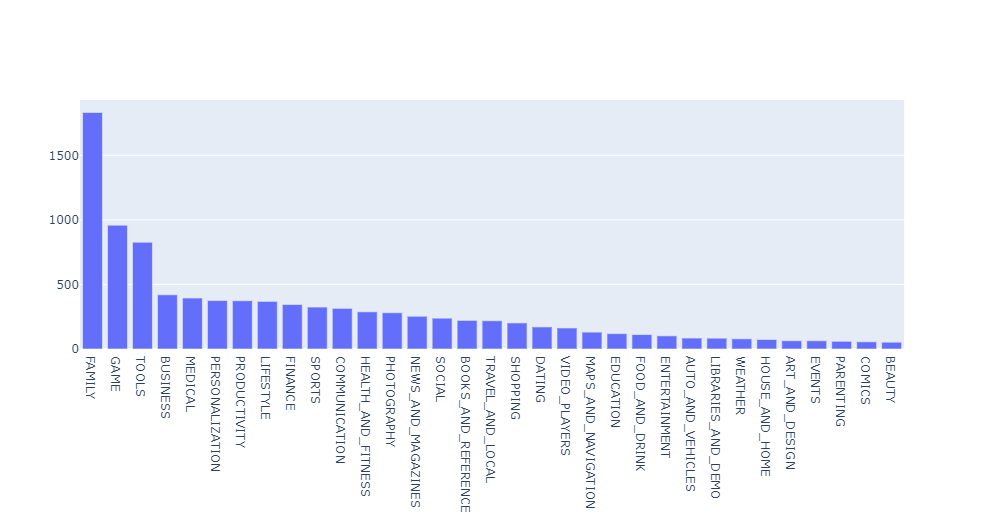
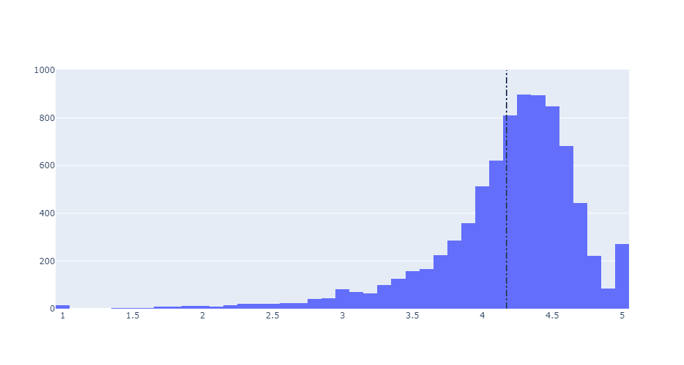
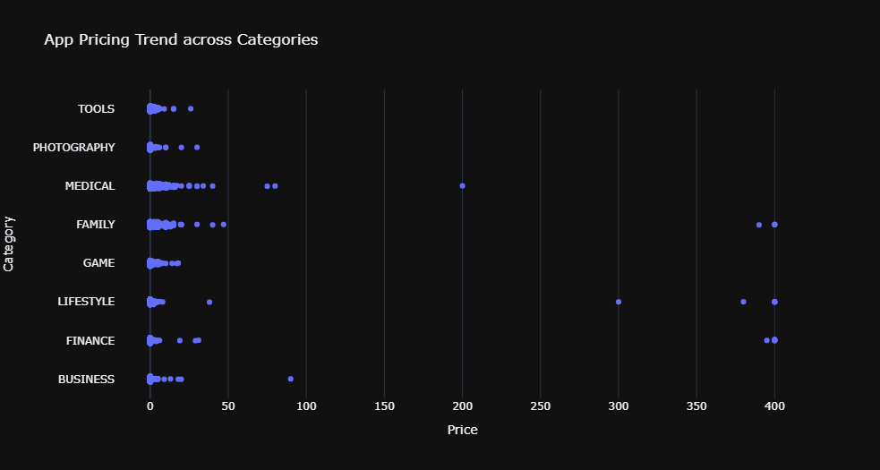
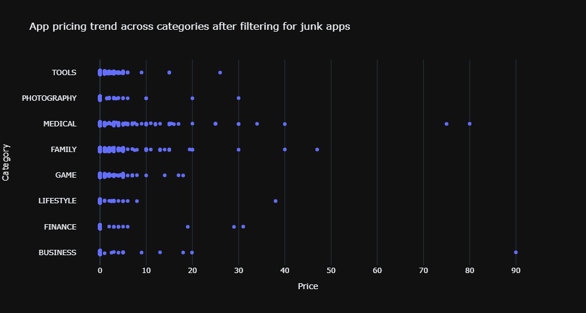
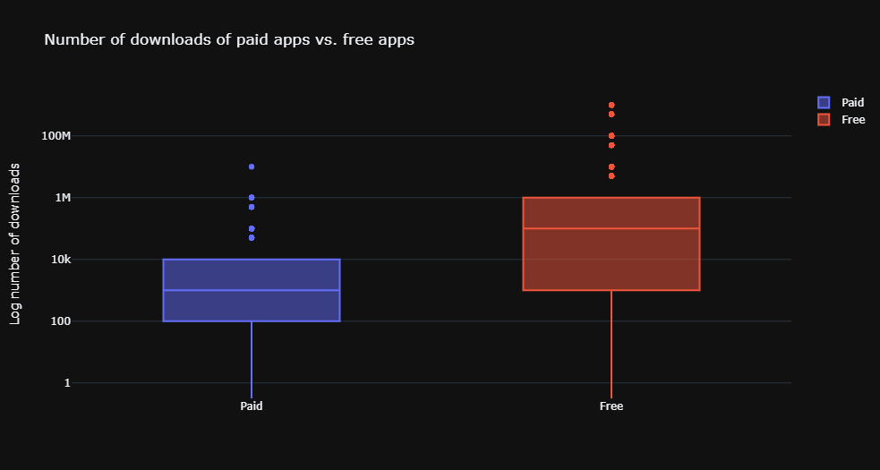
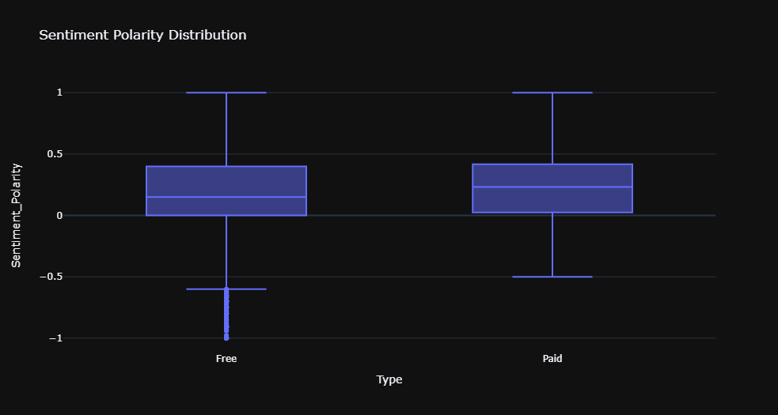

# Insights-into-the-Android-app-market-on-Google-Play
In this Analysis, I have Loaded, cleaned, and visualized Google Play Store data to gain insights into the Android app market.

Insights that I have drawn are as shown below:

### Exploring Apps with their Categories

### Checking Average of App Ratings
Average app rating =  4.17

### How the app category and price of an app are related.

### Filtering Junk Apps

### Popularity of paid apps to free apps

### Analyzing the sentiment analysis of user reviews on android apps on Google Play.

